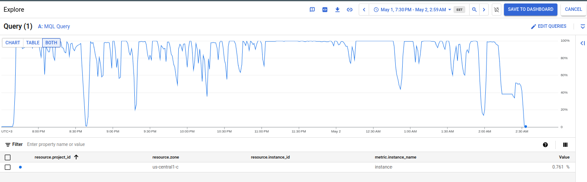
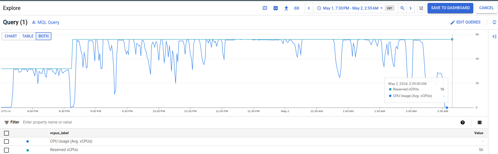

# Kaggle-2024 AutoML Grand Prix-PS4E05

This repository contains codes and notebooks related to the PS4E05 stage of the Kaggle 2024 AutoML Grand Prix.

## Dataset, Models, and Notebooks

* [Kaggle feature datasets](https://www.kaggle.com/datasets/mustafakeser4/ps4e05-fe-openfe-dataset)

* [Autogluon models for inference](https://www.kaggle.com/code/mustafakeser4/ps4e05-autogluon-amgp-models) are extracted from the notebook's output because I couldn't create a dataset for that, possibly due to its folder structure or the Python micro version of Kaggle (3.10.13).

* [Kaggle notebook versions (1-3)](https://www.kaggle.com/code/mustafakeser4/autogluon-ps4e05-baseline)

* [Vertex-AI Workbench training notebook | Submission - 4](submission-4-autogluon-fe-5h.ipynb)

* [Vertex-AI Workbench training notebook | Submission - 5](submission-5-autogluon-fe-openfe-3.5h-vertex-ai)

* [Kaggle inference notebook](https://www.kaggle.com/code/mustafakeser4/fe-openfe-autogluon-ps4e05-3-5h-inference)

## Method

### Split

For all submissions, I used the standard sklearn `train_test_split` with a stratify label and `test_size=0.01`. This `test_size=0.01` was selected because the train sample sizes were above 1M.

```python
X_train, X_test = train_test_split(
     train_data , test_size=0.01, random_state=42,stratify=train_data.FloodProbability)
```

### Submissions

#### Submission 1

* Submission 1 - Version 1: | Fast Baseline - 1 min time limit | 0.1 training sample | `optimize_deployment` preset | compute: Kaggle notebook

##### Notebooks
I started with Kaggle notebooks with baselines (versions 1-3) [AutoGluon PS4E05 Baseline🤖🦾](https://www.kaggle.com/code/mustafakeser4/autogluon-ps4e05-baseline):


##### Compute 
Kaggle Notebook v4 30gb

##### Evaluation:
LB score: 0.83755, X_test validate:
```json
{
  "r2": 0.8384926586300959,
  "root_mean_squared_error": -0.02050086314563354,
  "mean_squared_error": -0.00042028538971599554,
  "mean_absolute_error": -0.01614953244414867,
  "pearsonr": 0.9157592580218447,
  "median_absolute_error": -0.013010983467102055
}
```
#### Submission 2

* Submission 2 - Version 2: | all dataset - 4h time limit - `optimize_deployment` preset | compute: Kaggle notebook

##### Notebooks
Version 2 - [AutoGluon PS4E05 Baseline🤖🦾](https://www.kaggle.com/code/mustafakeser4/autogluon-ps4e05-baseline):

##### Compute 
Kaggle Notebook v4 30gb

##### Evaluation:

LB score: 0.85916, X_test validate:
```json
{
  "r2": 0.8583655592467155,
  "root_mean_squared_error": -0.019198197205545865,
  "mean_squared_error": -0.0003685707759430291,
  "mean_absolute_error": -0.015025637837556694,
  "pearsonr": 0.9266613724014717,
  "median_absolute_error": -0.011954272389411935
}
```


#### Submission 3

* Submission 3 - Version 3: | all dataset - 4h time limit - `best_quality` preset | compute: Kaggle notebook

##### Notebooks
Version 3 - [AutoGluon PS4E05 Baseline🤖🦾](https://www.kaggle.com/code/mustafakeser4/autogluon-ps4e05-baseline):

##### Compute 
Kaggle Notebook v4 30gb

##### Evaluation:
LB score: 0.86066, X_test validate:
```json
{
  "r2": 0.8603089156575733,
  "root_mean_squared_error": -0.019066033717065976,
  "mean_squared_error": -0.0003635136417002966,
  "mean_absolute_error": -0.014938768263686321,
  "pearsonr": 0.9275308287293952,
  "median_absolute_error": -0.012194173336029068
}
```
#### Submission 4

* Submission 4 - Version 4: | all dataset | +15 features | - 5h time limit - `best_quality` preset | compute: Vertex AI Workbench c2d 56vcpu 128gb

##### Notebooks

Notebook of Submission 4 - Vertex AI: [FE + AutoGluon PS4E05 🦾🤖 5h](submission-4-autogluon-fe-5h.ipynb)

Notebook of Submission 4 - Kaggle: [FE + AutoGluon PS4E05 🦾🤖 5h](https://www.kaggle.com/code/mustafakeser4/fe-autogluon-ps4e05-5h)

##### Compute
For this version, I used AutoGluon with extensive cloud compute research which is c2d 56vcpu 224 GB RAMs in Vertex AI Workbench TensorFlow Enterprise 2.11 (Intel® MKL-DNN/MKL) environment.

##### Feature Engineering
I used manually created aggregation stats features and ChatGPT generated features.

```python
# Feature Engineering Function
def features(df):
    df_ = df.copy()
    df_["sum"] = df[cols].sum(axis=1)
    df_["mean"] = df[cols].mean(axis=1)
    df_["std"] = df[cols].std(axis=1)
    df_["ptp"] = np.ptp(df[cols], axis=1)
    df_["norm"] = np.linalg.norm(df[cols], axis=1)
    df_['special'] = df_['sum'].isin(np.arange(72, 76)).astype(str)
    
    # Total Infrastructure Score
    df_['InfrastructureScore'] = df_['DeterioratingInfrastructure'] + df_['DrainageSystems'] + df_['DamsQuality']
    
    # Environmental Impact Score
    df_['EnvironmentalScore'] = df_['Deforestation'] + df_['Urbanization'] + df_['AgriculturalPractices'] + df_['WetlandLoss']
    
    # Socio-Political Score
    df_['SocioPoliticalScore'] = df_['PoliticalFactors'] + df_['IneffectiveDisasterPreparedness'] + df_['InadequatePlanning']
    
    # Geographical Vulnerability Score
    df_['GeographicalVulnerability

Score'] = df_['TopographyDrainage'] + df_['CoastalVulnerability'] + df_['Landslides'] + df_['Watersheds']
    
    # Cumulative Human Activity Score
    df_['HumanActivityScore'] = df_['PopulationScore'] + df_['Encroachments'] + df_['AgriculturalPractices']
    
    # Interaction Terms
    df_['MonsoonIntensity_RiverManagement'] = df_['MonsoonIntensity'] * df_['RiverManagement']
    df_['Deforestation_Urbanization'] = df_['Deforestation'] * df_['Urbanization']
    
    # Composite Indices
    df_['InfrastructureEnvironmentalIndex'] = (df_['InfrastructureScore'] + df_['EnvironmentalScore']) / 2
    df_['SocioGeographicalIndex'] = (df_['SocioPoliticalScore'] + df_['GeographicalVulnerabilityScore']) / 2
    
    return df_
```

##### Evaluation:

LB score: 0.86842, X_test validate:
```json
{
  "r2": 0.8679390397207102,
  "root_mean_squared_error": -0.0185380153697537,
  "mean_squared_error": -0.0003436580138492245,
  "mean_absolute_error": -0.014283278837506802,
  "pearsonr": 0.931639496047451,
  "median_absolute_error": -0.011493183374404886
}
```

#### Submission 5

* Submission 5 - Version 5: | all dataset | +15 features | openfe package, selected 20 best features | 3.5h time limit - `best_quality` preset | compute: Vertex AI Workbench c2d 56vcpu 128gb

##### Notebooks
Notebook of Submission 5 - Vertex AI: [FE + AutoGluon PS4E05 🦾🤖 5h](submission-5-autogluon-fe-openfe-3.5h-vertex-ai.ipynb)

Notebook of Submission 5 - Kaggle: [FE + openFe + AutoGluon PS4E05 🦾🤖 3.5h](https://www.kaggle.com/code/mustafakeser4/fe-openfe-autogluon-ps4e05-3-5h)

LB score: 0.86848, X_test validate:
```json
{
  "r2": 0.8678909243818036,
  "root_mean_squared_error": -0.018541392149917277,
  "mean_squared_error": -0.00034378322285701405,
  "mean_absolute_error": -0.014276862236063042,
  "pearsonr": 0.9316132159075368,
  "median_absolute_error": -0.011452838182449354
}
```
##### Compute
c2d 56vcpu 224 GB RAMs in Vertex AI Workbench TensorFlow Enterprise 2.11 (Intel® MKL-DNN/MKL)

##### Feature Engineering
Additionally, for these features, I used the openfe feature engineering package with a selection of 20 features.

```python
features = ofe.fit(data=train_data.drop(columns=[label,"id"]), label=train_data[label], n_jobs=n_jobs,
                   n_data_blocks=8, 
                   task='regression',
                   verbose = False,
                   metric="rmse"
                  )
train_x, test_x = transform(train_data.drop(columns=[label,"id"]), test_data.drop(columns=["id"]), ofe.new_features_list[:20], n_jobs=n_jobs)
```
##### Evaluation

Evaluation resulted on X_test:

```json
{
  "r2": 0.8678910990285527,
  "root_mean_squared_error": -0.0185413798941547,
  "mean_squared_error": -0.0003437827683793641,
  "mean_absolute_error": -0.0142768491422341,
  "pearsonr": 0.9316133100048873,
  "median_absolute_error": -0.011452838182449354
}
```

### Compute Resources

While training AutoGluon, it used very well and saturated compute resources.

* CPU Utilization



* CPU Usage vs. Reserved (vCPUs)


